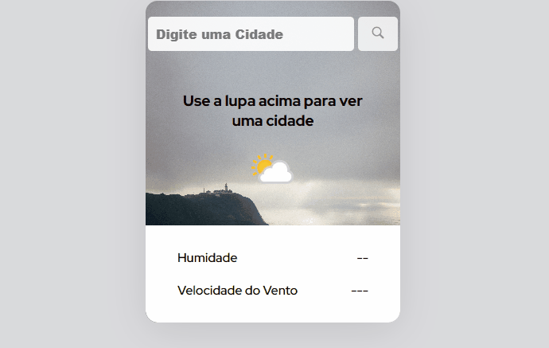

# Projeto de Previsão de Tempo com API.

Site web dedicado para mostrando a previsão de tempo em vida real em todo mundo. 

  Dedicated website to show real-life weather forecast around the world.

 

## Tecnologias utilizadas, Technologies used

- HTML
- CSS
- Javascript

## Site da APi
- <a href="https://www.weatherapi.com<">entrar</a>

## O que eu Aprendir com essas Tecnologias

O maior desafio foi aprender com uma Api uma coisa que nunca fiz porém decidir me desafia e  achei o resultado muito grafiticante!

Mexendo com API aprendir diversas coisas que irei implementar em meus projetos futuros, como await, fetch, json e muitos outros.

## What I Learned From These Technologies

The biggest challenge was learning something I've never done with an Api, but the decision challenged me and I found the result very graphic!

By working with the API, I learned several things that I will implement in my future projects, such as await, fetch, json and many others.
